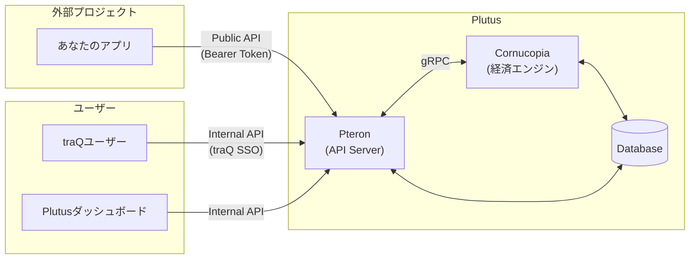
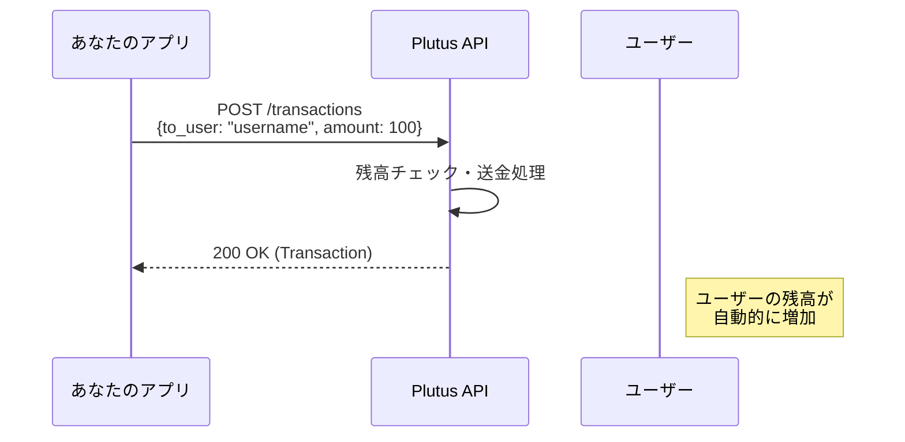
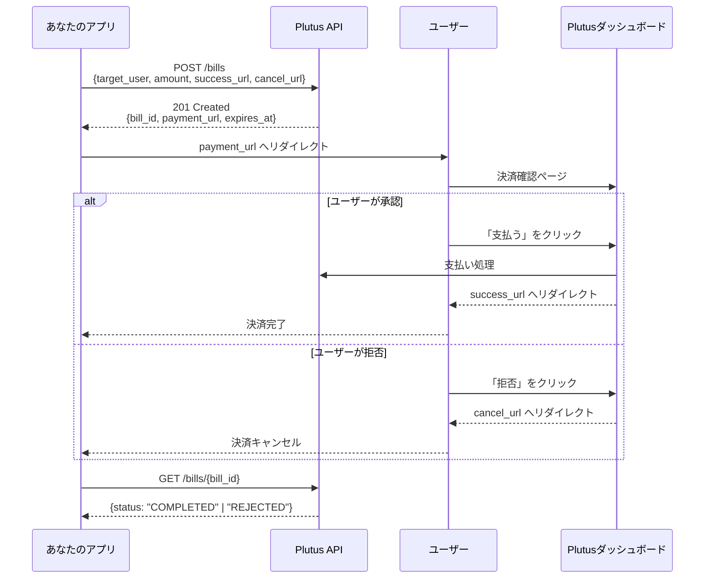

# Plutus API 仕様書

## 目次

1. [はじめに](#はじめに)
2. [システム概要](#システム概要)
3. [認証](#認証)
4. [API エンドポイント](#apiエンドポイント)
5. [データモデル](#データモデル)
6. [エラーハンドリング](#エラーハンドリング)
7. [実装ガイド](#実装ガイド)
8. [ユースケース](#ユースケース)

---

## はじめに

### Plutus とは

Plutus は、traP 内のプロジェクト間でポイント（仮想通貨）のやり取りを可能にする経済システムです。プロジェクト開発者は、この API を使用して以下のことが可能になります：

- **ユーザーへのポイント送金**: イベント報酬、参加賞、貢献への謝礼など
- **ユーザーからの決済受付**: サービス利用料、購入代金など（請求システム）

### 用語定義

| 用語                 | 説明                                                                |
| -------------------- | ------------------------------------------------------------------- |
| **プロジェクト**     | Plutus に登録されたサービス・アプリ。固有の残高（ウォレット）を持つ |
| **ユーザー**         | traP のメンバー。traQ ID で識別され、固有の残高を持つ               |
| **トランザクション** | プロジェクトとユーザー間の送金記録                                  |
| **請求 (Bill)**      | プロジェクトからユーザーへの支払い要求。ユーザーの承認が必要        |
| **残高 (Balance)**   | プロジェクトまたはユーザーが保有するポイント量                      |

### ベース URL

```
https://plutus.trap.jp/api/v1
```

---

## システム概要

### アーキテクチャ



### システムの流れ

#### ポイント送金フロー（プロジェクト → ユーザー）



#### 決済フロー（ユーザー → プロジェクト）



---

## 認証

### Bearer Token 認証

全ての API リクエストには Bearer Token 認証が必要です。

#### トークンの取得方法

1. **Plutus ダッシュボード**にアクセス
2. 自分のプロジェクトの設定ページへ移動
3. 「API クライアント」セクションで新しいクライアントを作成
4. 表示される `client_secret` を安全に保管（**一度しか表示されません**）

#### リクエストヘッダー

```http
Authorization: Bearer <client_secret>
```

#### 認証エラー

認証に失敗した場合、`401 Unauthorized` が返されます：

```json
{
	"message": "Invalid or expired token"
}
```

> [!CAUTION] > **`client_secret` の取り扱い**
>
> - 公開リポジトリにコミットしない
> - 環境変数で管理する
> - クライアントサイド（ブラウザ）に埋め込まない

---

## API エンドポイント

### Me (自プロジェクト情報)

#### `GET /me` - 自プロジェクトの情報を取得

自分のプロジェクトの基本情報と残高を取得します。

**リクエスト例**

```bash
curl -X GET "https://plutus.trap.jp/api/v1/me" \
  -H "Authorization: Bearer YOUR_CLIENT_SECRET"
```

**レスポンス例** (200 OK)

```json
{
	"id": "550e8400-e29b-41d4-a716-446655440000",
	"name": "my-awesome-project",
	"balance": 15000
}
```

---

#### `GET /me/transactions` - 自プロジェクトの取引履歴を取得

**クエリパラメータ**

| パラメータ | 型      | デフォルト | 説明                       |
| ---------- | ------- | ---------- | -------------------------- |
| `limit`    | integer | 20         | 取得件数 (最大 100)        |
| `cursor`   | string  | -          | ページネーション用カーソル |

**リクエスト例**

```bash
curl -X GET "https://plutus.trap.jp/api/v1/me/transactions?limit=10" \
  -H "Authorization: Bearer YOUR_CLIENT_SECRET"
```

**レスポンス例** (200 OK)

```json
{
	"items": [
		{
			"id": "7a9c8f00-1234-5678-abcd-1234567890ab",
			"type": "TRANSFER",
			"amount": 100,
			"project_id": "550e8400-e29b-41d4-a716-446655440000",
			"user_id": "660e8400-e29b-41d4-a716-446655440001",
			"user_name": "taro_trap",
			"description": "イベント参加賞",
			"created_at": "2025-12-20T10:30:00Z"
		}
	],
	"next_cursor": "eyJpZCI6IjdhOWM4ZjAwIn0="
}
```

---

#### `GET /me/bills` - 自プロジェクトが作成した請求一覧を取得

**クエリパラメータ**

| パラメータ | 型      | デフォルト | 説明                                                   |
| ---------- | ------- | ---------- | ------------------------------------------------------ |
| `status`   | string  | -          | フィルタ: `PENDING`, `COMPLETED`, `REJECTED`, `FAILED` |
| `limit`    | integer | 20         | 取得件数 (最大 100)                                    |
| `cursor`   | string  | -          | ページネーション用カーソル                             |

**リクエスト例**

```bash
curl -X GET "https://plutus.trap.jp/api/v1/me/bills?status=PENDING" \
  -H "Authorization: Bearer YOUR_CLIENT_SECRET"
```

**レスポンス例** (200 OK)

```json
{
	"items": [
		{
			"id": "8b0d9e00-5678-90ab-cdef-2345678901bc",
			"amount": 500,
			"user_id": "660e8400-e29b-41d4-a716-446655440001",
			"user_name": "taro_trap",
			"description": "プレミアム機能利用料",
			"status": "PENDING",
			"created_at": "2025-12-20T11:00:00Z"
		}
	],
	"next_cursor": null
}
```

---

### Transactions (送金)

#### `POST /transactions` - ユーザーへ送金する

プロジェクトからユーザーへポイントを送金します。

> [!IMPORTANT]
> この操作は即時実行され、取り消しできません。

**リクエストボディ**

| フィールド    | 型      | 必須 | 説明                             |
| ------------- | ------- | ---- | -------------------------------- |
| `to_user`     | string  | ✅   | 送金先の traQ ID                 |
| `amount`      | integer | ✅   | 送金額 (1 以上)                  |
| `description` | string  | -    | 送金理由（ユーザーに表示される） |
| `request_id`  | uuid    | 推奨 | 冪等性キー（重複送金防止）       |

**リクエスト例**

```bash
curl -X POST "https://plutus.trap.jp/api/v1/transactions" \
  -H "Authorization: Bearer YOUR_CLIENT_SECRET" \
  -H "Content-Type: application/json" \
  -d '{
    "to_user": "taro_trap",
    "amount": 100,
    "description": "ハッカソン参加賞",
    "request_id": "a1b2c3d4-e5f6-7890-abcd-ef1234567890"
  }'
```

**レスポンス例** (200 OK)

```json
{
	"id": "9c1e0f00-6789-01ab-cdef-3456789012cd",
	"type": "TRANSFER",
	"amount": 100,
	"project_id": "550e8400-e29b-41d4-a716-446655440000",
	"user_id": "660e8400-e29b-41d4-a716-446655440001",
	"user_name": "taro_trap",
	"description": "ハッカソン参加賞",
	"created_at": "2025-12-20T12:00:00Z"
}
```

**エラーレスポンス例**

| ステータス | 説明           | 例                               |
| ---------- | -------------- | -------------------------------- |
| 400        | リクエスト不正 | 残高不足、ユーザー不在、金額不正 |
| 401        | 認証エラー     | 無効なトークン                   |
| 409        | 重複リクエスト | 同じ `request_id` で既に処理済み |

```json
{
	"message": "Insufficient balance"
}
```

---

### Bills (請求)

#### `POST /bills` - ユーザーへの請求を作成する

ユーザーに対して支払い請求を作成します。ユーザーは決済確認ページで承認/拒否を選択できます。

**リクエストボディ**

| フィールド    | 型      | 必須 | 説明                                      |
| ------------- | ------- | ---- | ----------------------------------------- |
| `target_user` | string  | ✅   | 請求先の traQ ID                          |
| `amount`      | integer | ✅   | 請求額 (1 以上)                           |
| `description` | string  | -    | 請求内容（ユーザーに表示される）          |
| `success_url` | uri     | ✅   | 決済成功時のリダイレクト先 URL            |
| `cancel_url`  | uri     | ✅   | 決済キャンセル/拒否時のリダイレクト先 URL |

**リクエスト例**

```bash
curl -X POST "https://plutus.trap.jp/api/v1/bills" \
  -H "Authorization: Bearer YOUR_CLIENT_SECRET" \
  -H "Content-Type: application/json" \
  -d '{
    "target_user": "hanako_trap",
    "amount": 500,
    "description": "プレミアムプラン（1ヶ月）",
    "success_url": "https://my-app.trap.games/payment/success",
    "cancel_url": "https://my-app.trap.games/payment/cancel"
  }'
```

**レスポンス例** (201 Created)

```json
{
	"bill_id": "2d3e4f00-7890-12ab-cdef-4567890123de",
	"payment_url": "https://plutus.trap.jp/pay/2d3e4f00-7890-12ab-cdef-4567890123de",
	"expires_at": "2025-12-20T13:00:00Z"
}
```

> [!TIP] > `payment_url` にユーザーをリダイレクトさせてください。ユーザーはこのページで請求内容を確認し、承認/拒否を行います。

---

#### `GET /bills/{bill_id}` - 請求のステータスを確認する

**パスパラメータ**

| パラメータ | 型   | 説明    |
| ---------- | ---- | ------- |
| `bill_id`  | uuid | 請求 ID |

**リクエスト例**

```bash
curl -X GET "https://plutus.trap.jp/api/v1/bills/2d3e4f00-7890-12ab-cdef-4567890123de" \
  -H "Authorization: Bearer YOUR_CLIENT_SECRET"
```

**レスポンス例** (200 OK)

```json
{
	"id": "2d3e4f00-7890-12ab-cdef-4567890123de",
	"amount": 500,
	"user_id": "770e8400-e29b-41d4-a716-446655440002",
	"user_name": "hanako_trap",
	"description": "プレミアムプラン（1ヶ月）",
	"status": "COMPLETED",
	"created_at": "2025-12-20T12:30:00Z"
}
```

---

#### `POST /bills/{bill_id}/cancel` - 未処理の請求をキャンセルする

`PENDING` 状態の請求のみキャンセル可能です。

**リクエスト例**

```bash
curl -X POST "https://plutus.trap.jp/api/v1/bills/2d3e4f00-7890-12ab-cdef-4567890123de/cancel" \
  -H "Authorization: Bearer YOUR_CLIENT_SECRET"
```

**レスポンス** (204 No Content)

（ボディなし）

**エラーレスポンス例**

| ステータス | 説明               |
| ---------- | ------------------ |
| 404        | 請求が見つからない |
| 409        | 請求は既に処理済み |

---

## データモデル

### Project

| フィールド | 型     | 説明                     |
| ---------- | ------ | ------------------------ |
| `id`       | uuid   | プロジェクトの一意識別子 |
| `name`     | string | プロジェクト名           |
| `balance`  | int64  | 現在の残高               |

### Transaction

| フィールド    | 型       | 説明                         |
| ------------- | -------- | ---------------------------- |
| `id`          | uuid     | トランザクションの一意識別子 |
| `type`        | enum     | 取引の種類                   |
| `amount`      | int64    | 送金額                       |
| `project_id`  | uuid     | プロジェクト ID              |
| `user_id`     | uuid     | ユーザー ID                  |
| `user_name`   | string   | ユーザーの traQ ID           |
| `description` | string   | 取引の説明                   |
| `created_at`  | datetime | 作成日時 (ISO 8601)          |

**Transaction Type**

| 値             | 説明         | 資金の流れ     |
| -------------- | ------------ | -------------- |
| `TRANSFER`     | 送金         | Project → User |
| `BILL_PAYMENT` | 請求の支払い | User → Project |

### Bill

| フィールド    | 型       | 説明                       |
| ------------- | -------- | -------------------------- |
| `id`          | uuid     | 請求の一意識別子           |
| `amount`      | int64    | 請求額                     |
| `user_id`     | uuid     | 請求対象ユーザー ID        |
| `user_name`   | string   | 請求対象ユーザーの traQ ID |
| `description` | string   | 請求内容の説明             |
| `status`      | enum     | 請求のステータス           |
| `created_at`  | datetime | 作成日時 (ISO 8601)        |

**Bill Status**

| 値          | 説明                         |
| ----------- | ---------------------------- |
| `PENDING`   | 未払い（ユーザーの承認待ち） |
| `COMPLETED` | 支払い完了                   |
| `REJECTED`  | ユーザーが拒否               |
| `FAILED`    | 支払い失敗（残高不足など）   |

### Error

| フィールド | 型     | 説明             |
| ---------- | ------ | ---------------- |
| `message`  | string | エラーメッセージ |

---

## エラーハンドリング

### HTTP ステータスコード一覧

| コード | 説明                             | 対処方法                       |
| ------ | -------------------------------- | ------------------------------ |
| 200    | 成功                             | -                              |
| 201    | 作成成功                         | -                              |
| 204    | 処理成功（レスポンスボディなし） | -                              |
| 400    | リクエスト不正                   | リクエストパラメータを確認     |
| 401    | 認証エラー                       | トークンを確認                 |
| 404    | リソースが見つからない           | ID を確認                      |
| 409    | 競合                             | 重複リクエストまたは状態不整合 |
| 500    | サーバーエラー                   | 時間をおいて再試行             |

### エラーレスポンス形式

すべてのエラーは以下の形式で返されます：

```json
{
	"message": "エラーの詳細説明"
}
```

### よくあるエラーと対処法

#### 残高不足

```json
{ "message": "Insufficient balance" }
```

→ プロジェクトの残高を確認してください。送金前に `GET /me` で残高を確認することを推奨します。

#### ユーザー不在

```json
{ "message": "User not found: unknown_user" }
```

→ 指定した traQ ID が正しいか確認してください。

#### 重複リクエスト

```json
{ "message": "Duplicate request" }
```

→ 同じ `request_id` で既にリクエストが処理されています。冪等性が保証されているため、前回のレスポンスを参照してください。

---

## 実装ガイド

### TypeScript/JavaScript

```typescript
// plutus-client.ts
interface PlutusClient {
	getMe(): Promise<Project>;
	createTransaction(params: CreateTransactionParams): Promise<Transaction>;
	createBill(params: CreateBillParams): Promise<CreateBillResponse>;
	getBill(billId: string): Promise<Bill>;
}

const createPlutusClient = (clientSecret: string): PlutusClient => {
	const baseUrl = "https://plutus.trap.jp/api/v1";

	const headers = {
		Authorization: `Bearer ${clientSecret}`,
		"Content-Type": "application/json",
	};

	return {
		async getMe() {
			const res = await fetch(`${baseUrl}/me`, { headers });
			if (!res.ok) throw new Error(await res.text());
			return res.json();
		},

		async createTransaction(params) {
			const res = await fetch(`${baseUrl}/transactions`, {
				method: "POST",
				headers,
				body: JSON.stringify({
					to_user: params.toUser,
					amount: params.amount,
					description: params.description,
					request_id: params.requestId ?? crypto.randomUUID(),
				}),
			});
			if (!res.ok) throw new Error(await res.text());
			return res.json();
		},

		async createBill(params) {
			const res = await fetch(`${baseUrl}/bills`, {
				method: "POST",
				headers,
				body: JSON.stringify({
					target_user: params.targetUser,
					amount: params.amount,
					description: params.description,
					success_url: params.successUrl,
					cancel_url: params.cancelUrl,
				}),
			});
			if (!res.ok) throw new Error(await res.text());
			return res.json();
		},

		async getBill(billId) {
			const res = await fetch(`${baseUrl}/bills/${billId}`, { headers });
			if (!res.ok) throw new Error(await res.text());
			return res.json();
		},
	};
};

// 使用例
const client = createPlutusClient(process.env.PLUTUS_CLIENT_SECRET!);

// ユーザーに報酬を送金
await client.createTransaction({
	toUser: "taro_trap",
	amount: 100,
	description: "ハッカソン参加賞",
});

// 決済を作成
const { payment_url } = await client.createBill({
	targetUser: "hanako_trap",
	amount: 500,
	description: "プレミアムプラン",
	successUrl: "https://my-app.com/success",
	cancelUrl: "https://my-app.com/cancel",
});

// ユーザーを決済ページへリダイレクト
redirect(payment_url);
```

### Go

```go
package plutus

import (
	"bytes"
	"encoding/json"
	"fmt"
	"net/http"
)

type Client struct {
	baseURL      string
	clientSecret string
	httpClient   *http.Client
}

func NewClient(clientSecret string) *Client {
	return &Client{
		baseURL:      "https://plutus.trap.jp/api/v1",
		clientSecret: clientSecret,
		httpClient:   &http.Client{},
	}
}

func (c *Client) doRequest(method, path string, body interface{}, result interface{}) error {
	var buf bytes.Buffer
	if body != nil {
		if err := json.NewEncoder(&buf).Encode(body); err != nil {
			return err
		}
	}

	req, err := http.NewRequest(method, c.baseURL+path, &buf)
	if err != nil {
		return err
	}

	req.Header.Set("Authorization", "Bearer "+c.clientSecret)
	req.Header.Set("Content-Type", "application/json")

	resp, err := c.httpClient.Do(req)
	if err != nil {
		return err
	}
	defer resp.Body.Close()

	if resp.StatusCode >= 400 {
		var errResp struct{ Message string }
		json.NewDecoder(resp.Body).Decode(&errResp)
		return fmt.Errorf("API error: %s", errResp.Message)
	}

	if result != nil {
		return json.NewDecoder(resp.Body).Decode(result)
	}
	return nil
}

type CreateTransactionRequest struct {
	ToUser      string `json:"to_user"`
	Amount      int64  `json:"amount"`
	Description string `json:"description,omitempty"`
	RequestID   string `json:"request_id,omitempty"`
}

func (c *Client) CreateTransaction(req CreateTransactionRequest) (*Transaction, error) {
	var tx Transaction
	err := c.doRequest("POST", "/transactions", req, &tx)
	return &tx, err
}

// 使用例
func main() {
	client := NewClient(os.Getenv("PLUTUS_CLIENT_SECRET"))

	tx, err := client.CreateTransaction(CreateTransactionRequest{
		ToUser:      "taro_trap",
		Amount:      100,
		Description: "ハッカソン参加賞",
	})
	if err != nil {
		log.Fatal(err)
	}

	fmt.Printf("Transaction created: %s\n", tx.ID)
}
```

---

## ユースケース

### ケース 1: イベント参加者への報酬配布

#### シナリオ

ハッカソンの参加者全員に 100 ポイントを配布したい。

#### 実装

```typescript
const participants = ["user1", "user2", "user3" /* ... */];

for (const userId of participants) {
	try {
		await client.createTransaction({
			toUser: userId,
			amount: 100,
			description: "ハッカソン25冬 参加賞",
			requestId: `hackathon-25w-${userId}`, // 冪等性キー
		});
		console.log(`Sent 100pt to ${userId}`);
	} catch (error) {
		console.error(`Failed for ${userId}:`, error);
	}
}
```

> [!TIP] > `requestId` にユーザー ID を含めることで、万が一スクリプトが途中で失敗しても、再実行時に同じユーザーへの二重送金を防げます。

---

### ケース 2: ゲーム内アイテム購入

#### シナリオ

ユーザーがゲーム内で有料アイテム（300 ポイント）を購入する。

#### フロー

1. ユーザーが「購入」ボタンをクリック
2. 請求を作成し、決済ページへリダイレクト
3. ユーザーが承認後、success_url に戻る
4. 請求ステータスを確認し、アイテムを付与

#### 実装

```typescript
// 購入リクエスト処理
app.post("/api/items/:itemId/purchase", async (req, res) => {
	const { itemId } = req.params;
	const userId = req.user.trapId;
	const item = await getItem(itemId);

	// 請求を作成
	const { bill_id, payment_url } = await client.createBill({
		targetUser: userId,
		amount: item.price,
		description: `${item.name} の購入`,
		successUrl: `${BASE_URL}/purchase/complete?bill=${bill_id}`,
		cancelUrl: `${BASE_URL}/shop`,
	});

	// 請求IDをセッションに保存
	req.session.pendingPurchase = { billId: bill_id, itemId };

	// 決済ページへリダイレクト
	res.redirect(payment_url);
});

// 決済完了コールバック
app.get("/purchase/complete", async (req, res) => {
	const { bill: billId } = req.query;
	const pending = req.session.pendingPurchase;

	if (!pending || pending.billId !== billId) {
		return res.status(400).send("Invalid session");
	}

	// ステータス確認
	const bill = await client.getBill(billId);

	if (bill.status === "COMPLETED") {
		// アイテム付与
		await grantItem(req.user.id, pending.itemId);
		delete req.session.pendingPurchase;
		res.redirect("/inventory?purchased=1");
	} else {
		res.redirect("/shop?error=payment_failed");
	}
});
```

---

### ケース 3: 月額サブスクリプション

#### シナリオ

毎月 1 日に登録ユーザーへ 500 ポイントの請求を送る。

#### 実装（定期バッチ）

```typescript
// cron: 0 0 1 * * (毎月1日 0:00)
async function processMonthlySubscriptions() {
	const subscribers = await getActiveSubscribers();

	for (const sub of subscribers) {
		const billId = `sub-${sub.userId}-${new Date().toISOString().slice(0, 7)}`;

		try {
			// 既に作成済みの場合はスキップ
			if (await isBillExists(billId)) continue;

			const result = await client.createBill({
				targetUser: sub.trapId,
				amount: 500,
				description: `プレミアムプラン（${new Date().toLocaleDateString("ja-JP", {
					year: "numeric",
					month: "long",
				})}）`,
				successUrl: `${BASE_URL}/subscription/renewed`,
				cancelUrl: `${BASE_URL}/subscription/cancelled`,
			});

			await saveBillRecord(sub.userId, result.bill_id);

			// ユーザーに通知（traQのWebhookなど）
			await notifyUser(
				sub.trapId,
				`今月のサブスク請求を送信しました。決済はこちら: ${result.payment_url}`
			);
		} catch (error) {
			console.error(`Failed for ${sub.userId}:`, error);
		}
	}
}
```

---

## 付録

### OpenAPI 仕様

詳細な OpenAPI (Swagger) 仕様は以下で確認できます：

- **Public API**: [specs/openapi/pteron.yaml](file:///Users/koki/Projects/traP/hackathon/plutus/specs/openapi/pteron.yaml)

### 関連リンク

- Plutus ダッシュボード: https://plutus.trap.jp
- traQ: https://traq.trap.jp
- サポート: traQ の #general または #plutus チャンネル

### 変更履歴

| 日付       | バージョン  | 変更内容 |
| ---------- | ----------- | -------- |
| 2025-12-20 | 1.0.0-draft | 初版作成 |

---

> [!NOTE] > **この仕様書について**
>
> この仕様書はドラフト版です。フィードバックや質問がありましたら、traQ の #plutus チャンネルまでお願いします。
